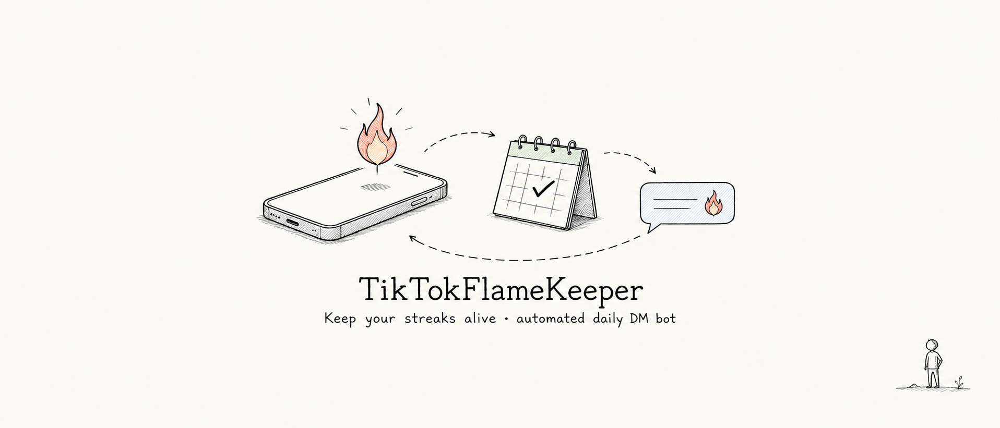
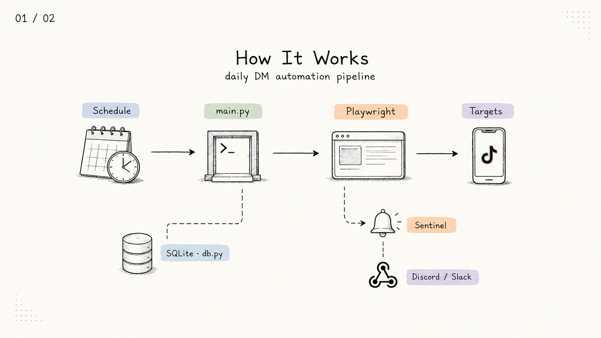

<p align="center">
  
</p>

---

TikTokFlameKeeper is a Python automation bot that sends daily DM messages on TikTok to maintain streak status with your contacts. Runs headlessly on any cheap server via a systemd timer — set it and forget it.

## Architecture

<p align="center">
  
</p>

## Features

- **Headless Chromium** via Playwright with anti-detection stealth patches
- **Message rotation** — least-recently-used picking, never repeats within 7 days
- **Randomized schedule** — systemd timer fires daily in a configurable 2-hour window with jitter
- **SQLite persistence** — tracks sent messages per target
- **Sentinel monitoring** — detects captchas, login walls, and rate limits
- **Webhook alerts** — Discord/Slack notifications on failure
- **Cookie import** — import session from any browser's JSON export

## Requirements

- Python 3.10+
- Playwright + Chromium

## Quick Start

```bash
# 1. Clone and install
git clone https://github.com/helloqiu/TikTokFlameKeeper.git
cd TikTokFlameKeeper
pip install -r requirements.txt
playwright install chromium

# 2. Setup — logs into TikTok in a visible browser
python3 main.py setup

# 3. Edit config — add your targets and messages
nano ~/.tiktok-flamekeeper/config.json

# 4. Run
python3 main.py run
```

## Commands

| Command | Description |
|---------|-------------|
| `python3 main.py setup` | Open browser for interactive TikTok login |
| `python3 main.py run` | Headless DM send to all targets |
| `python3 main.py run --debug` | Same, but with visible browser window |
| `python3 main.py log` | Show recent message history |
| `python3 main.py log --target @user` | Filter history by target |
| `python3 main.py test` | Check login state only |
| `python3 main.py import-cookies cookies.json` | Import session from cookie file |

## Configuration

Copy `config.json.example` → `~/.tiktok-flamekeeper/config.json` and edit:

```json
{
  "targets": ["@user1", "@user2"],
  "messages": ["🔥 streak", "day streak!", "🔥🔥", "keep the fire"],
  "window_start": 9,
  "window_end": 11,
  "webhook_url": null,
  "min_pause_between_targets": 45,
  "max_pause_between_targets": 120
}
```

| Field | Description |
|-------|-------------|
| `targets` | TikTok DM nicknames (display names in sidebar) |
| `messages` | Pool of messages, rotated LRU-style |
| `window_start` / `window_end` | Hour range for randomized daily trigger |
| `webhook_url` | Discord/Slack webhook for failure alerts (optional) |
| `min_pause_between_targets` / `max_pause_between_targets` | Random delay between DMs (seconds) |

## Deployment

See [DEPLOY.md](DEPLOY.md) for DigitalOcean droplet setup with systemd timer.

## Project Structure

```
├── main.py            CLI entry point (setup, run, log, test, import-cookies)
├── browser.py         Playwright automation + stealth browser
├── db.py              SQLite persistence + LRU message picker
├── sentinel.py        Captcha/rate-limit detection + webhook alerts
├── config.json.example
├── requirements.txt
├── install.sh         Single-server install script
├── deploy.sh          Full remote deployment script
├── server_setup.sh    DigitalOcean droplet bootstrap
└── assets/            README images
```

## License

MIT
